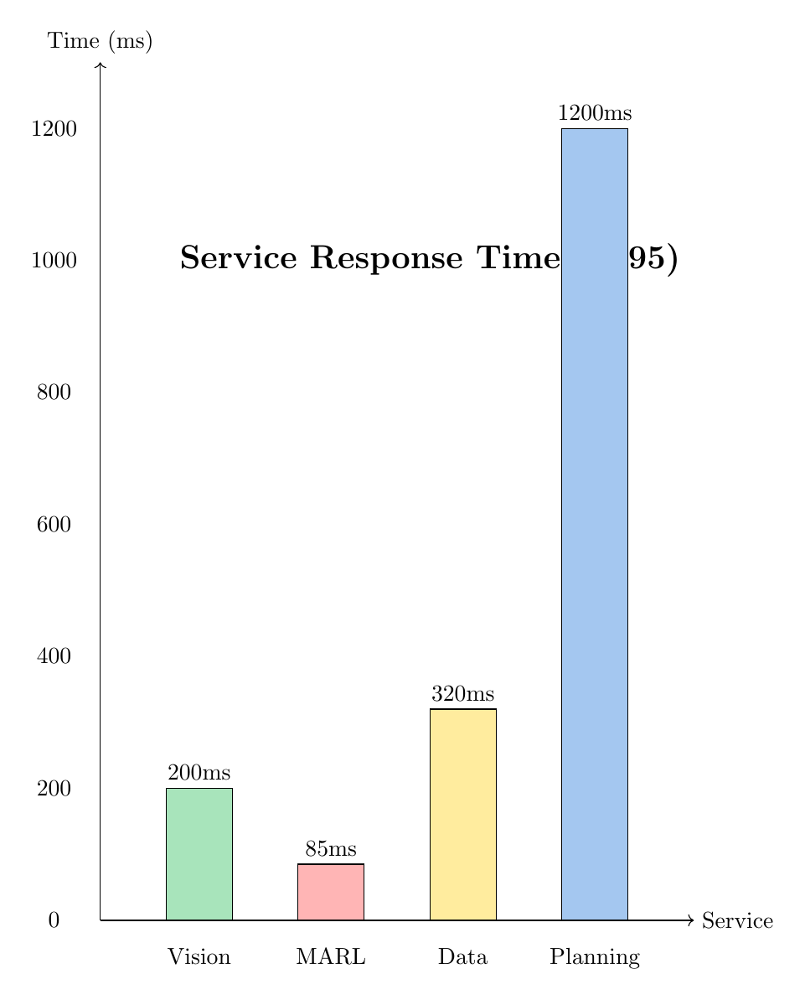

# Production Deployment Guide

## Essential Files for GitHub/Production

### Core Application (REQUIRED)
```
src/
├── core/
│   ├── multi_agent_rl.py          # MARL system
│   ├── mission_planner.py          # Mission planning
│   └── terrain_analyzer.py         # Vision analysis
├── interfaces/
│   ├── web_api.py                  # FastAPI application
│   ├── marl_endpoint.py            # MARL endpoints
│   ├── chat_interface.html         # Web UI
│   └── demo_dashboard.html         # Dashboard
└── utils/
    └── logging_config.py
```

### Microservices (REQUIRED)
```
services/
├── vision/
│   ├── app/main.py
│   ├── Dockerfile
│   └── requirements.txt
├── marl/
│   ├── app/main.py
│   ├── Dockerfile
│   └── requirements.txt
├── data-integration/
│   ├── app/main.py
│   ├── Dockerfile
│   └── requirements.txt
└── planning/
    ├── app/main.py
    ├── Dockerfile
    └── requirements.txt
```

### Models (REQUIRED)
```
models/
└── marl/
    ├── route_agent.pkl
    ├── power_agent.pkl
    ├── science_agent.pkl
    ├── hazard_agent.pkl
    └── strategy_agent.pkl
```

### Configuration (REQUIRED)
```
├── docker-compose.yml
├── requirements.txt
├── .env.example
├── .gitignore
└── .dockerignore
```

### Database (REQUIRED)
```
database/
├── init.sql
└── schema.sql
```

### Documentation (REQUIRED)
```
├── README.md
├── MARL_SYSTEM.md
├── MICROSERVICES_DEPLOYMENT.md
├── LICENSE
└── docs/
    ├── tikz_diagrams.tex
    ├── tikz_diagrams.pdf
    └── screenshots/              # Add your output screenshots here
        ├── marl_training.png
        ├── agent_confidence.png
        ├── service_performance.png
        ├── mission_plan_output.png
        └── architecture_overview.png
```

### Scripts (REQUIRED)
```
scripts/
├── train_marl.py
└── configure_gateway.sh
```

### Tests (OPTIONAL but recommended)
```
tests/
├── test_marl.py
├── test_vision.py
└── test_integration.py
```

---

## Files to EXCLUDE from GitHub

### DO NOT COMMIT:
- `venv/` or `.venv/` - Virtual environments
- `__pycache__/` - Python cache
- `*.pyc`, `*.pyo`, `*.pyd` - Compiled Python
- `.DS_Store` - macOS files
- `*.log` - Log files
- `.env` - Environment secrets
- `logs/*.log` - Runtime logs
- `data/cache/` - Cached data
- `data/temp/` - Temporary files
- Large DEM files (provide download script instead)
- IDE files (`.vscode/`, `.idea/`)
- Build artifacts (`build/`, `dist/`, `*.egg-info/`)

---

## Cleanup Procedure

### Step 1: Run Cleanup Script

```bash
chmod +x scripts/cleanup_for_production.sh
./scripts/cleanup_for_production.sh
```

This will:
- Remove Python cache files
- Remove virtual environments
- Remove IDE/editor files
- Remove log files
- Remove build artifacts
- Create .gitignore and .dockerignore

### Step 2: Generate Screenshots

**Option A: Use provided script**
```bash
# Fix matplotlib if needed
pip install matplotlib numpy

# Generate screenshots
python3 scripts/generate_screenshots.py
```

**Option B: Manual screenshots**
1. Run MARL training and take screenshot of terminal output
2. Screenshot the web dashboard/UI
3. Take screenshot of mission plan output
4. Export TikZ diagrams as PNG:
   ```bash
   cd docs
   pdftoppm tikz_diagrams.pdf screenshot -png -r 300
   mv screenshot-*.png screenshots/
   ```

### Step 3: Add Screenshots to README

Edit `README.md` and add screenshots section:

```markdown
## Output Screenshots

### MARL Training Performance


### Agent Confidence Scores


### Mission Plan Output


### Service Performance


### System Architecture

```

### Step 4: Review Changes

```bash
# Check what will be committed
git status

# Review file sizes
du -sh * | sort -h

# Check for large files (should be <100MB)
find . -type f -size +10M
```

### Step 5: Git Configuration

```bash
# Initialize git if needed
git init

# Add .gitattributes for large files
cat > .gitattributes << 'EOF'
*.pkl filter=lfs diff=lfs merge=lfs -text
*.pth filter=lfs diff=lfs merge=lfs -text
*.bin filter=lfs diff=lfs merge=lfs -text
*.tif filter=lfs diff=lfs merge=lfs -text
EOF

# Add files
git add .

# Commit
git commit -m "Initial commit - Production ready"

# Add remote
git remote add origin https://github.com/yourusername/mars_mission-ai.git

# Push
git push -u origin main
```

---

## Production Deployment Steps

### 1. Environment Setup

```bash
# Clone repository
git clone https://github.com/yourusername/mars_mission-ai.git
cd mars_mission-ai

# Create .env file
cp .env.example .env
# Edit .env with your API keys
```

### 2. Docker Deployment

```bash
# Build and start all services
docker-compose up --build -d

# Configure API Gateway
chmod +x scripts/configure_gateway.sh
./scripts/configure_gateway.sh

# Check service health
curl http://localhost:8005/services/status
```

### 3. Verify Services

```bash
# Check all services
docker-compose ps

# View logs
docker-compose logs -f

# Test endpoints
curl http://localhost:8002/health  # Vision
curl http://localhost:8003/health  # MARL
curl http://localhost:8004/health  # Data
curl http://localhost:8005/health  # Planning
```

### 4. Load Trained Models

Models should be in `models/marl/`. If not:

```bash
# Train MARL agents
python scripts/train_marl.py --episodes 500

# Or download pre-trained models
# (provide download link in your repo)
```

### 5. Production Checklist

- [ ] All services start without errors
- [ ] Health endpoints return 200 OK
- [ ] Database initialized
- [ ] Redis cache working
- [ ] API Gateway configured
- [ ] Environment variables set
- [ ] MARL models loaded
- [ ] Vision service functional
- [ ] Logs directory created
- [ ] Monitoring enabled

---

## Repository Size Optimization

### Before GitHub Upload

Check repository size:
```bash
# Total size
du -sh .

# Largest files
du -ah . | sort -rh | head -20

# Files over 50MB
find . -type f -size +50M
```

### Git LFS for Large Files

If models are >100MB, use Git LFS:

```bash
# Install Git LFS
brew install git-lfs  # macOS
# or: sudo apt-get install git-lfs  # Linux

# Initialize
git lfs install

# Track large files
git lfs track "*.pkl"
git lfs track "*.pth"
git lfs track "*.bin"

# Verify
git lfs ls-files

# Add and commit
git add .gitattributes
git commit -m "Add Git LFS tracking"
```

---

## Screenshot Guide

### What to Include

1. **MARL Training Output**
   - Terminal showing training progress
   - Episode numbers, rewards, epsilon decay
   - Final convergence message

2. **Web Dashboard**
   - Mission planning interface
   - Service status indicators
   - Real-time metrics

3. **Mission Plan Example**
   - Input parameters
   - Optimized actions from MARL
   - Expected completion time
   - Power/time estimates

4. **System Architecture**
   - Services diagram (use TikZ PDF exports)
   - Data flow visualization
   - Component interaction

5. **Performance Metrics**
   - Service response times
   - Agent confidence scores
   - Resource utilization graphs

### Screenshot Tools

**macOS**:
- Cmd+Shift+4: Selection screenshot
- Cmd+Shift+3: Full screen screenshot

**Linux**:
- gnome-screenshot: Built-in tool
- flameshot: Advanced screenshot tool

**Terminal Output**:
```bash
# Save command output
python scripts/train_marl.py | tee training_output.txt

# Convert to image
cat training_output.txt | imgcat  # iTerm2
# or use terminal2image tools
```

---

## Final Checks

### Before Pushing to GitHub

```bash
# 1. Clean build
./scripts/cleanup_for_production.sh

# 2. Test local build
docker-compose up --build

# 3. Run tests
pytest tests/

# 4. Check file sizes
du -sh * | grep "M\|G"

# 5. Review .gitignore
cat .gitignore

# 6. Verify no secrets
grep -r "API_KEY\|PASSWORD\|SECRET" . --exclude-dir=.git

# 7. Check documentation
ls -lh README.md MARL_SYSTEM.md

# 8. Verify screenshots
ls -lh docs/screenshots/
```

### After Pushing

1. Check GitHub repository page loads correctly
2. Verify README renders with images
3. Test clone on fresh machine
4. Verify Docker build from scratch
5. Check all links in documentation
6. Add repository topics/tags
7. Create first release/tag
8. Update GitHub description

---

## Maintenance

### Regular Updates

```bash
# Update dependencies
pip list --outdated
pip install --upgrade -r requirements.txt

# Rebuild Docker images
docker-compose build --no-cache

# Retrain models (if needed)
python scripts/train_marl.py --episodes 500

# Update documentation
# Regenerate diagrams if architecture changes
```

### Monitoring Production

```bash
# View logs
docker-compose logs -f --tail=100

# Check resource usage
docker stats

# Database health
docker-compose exec postgres psql -U mars_admin -d mars_mission -c "\dt"

# Service health
curl http://localhost:8005/services/status | jq
```

---

## Troubleshooting

### Common Issues

**Issue**: Services not starting
```bash
# Check logs
docker-compose logs service-name

# Rebuild
docker-compose up --build --force-recreate
```

**Issue**: Large repository size
```bash
# Find large files
find . -type f -size +10M -not -path "./.git/*"

# Use Git LFS or provide download links
```

**Issue**: Images not showing in README
```bash
# Check paths are relative
# Use: docs/screenshots/image.png
# Not: /Users/you/project/docs/screenshots/image.png
```

---

**Status**: Ready for production deployment
**Last Updated**: 2024
**Version**: 1.0.0
